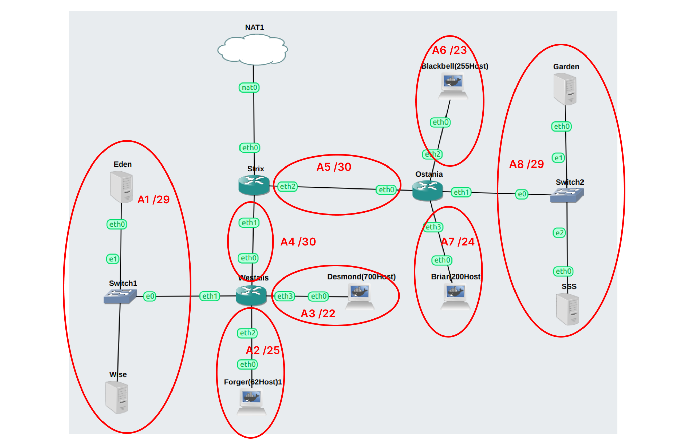
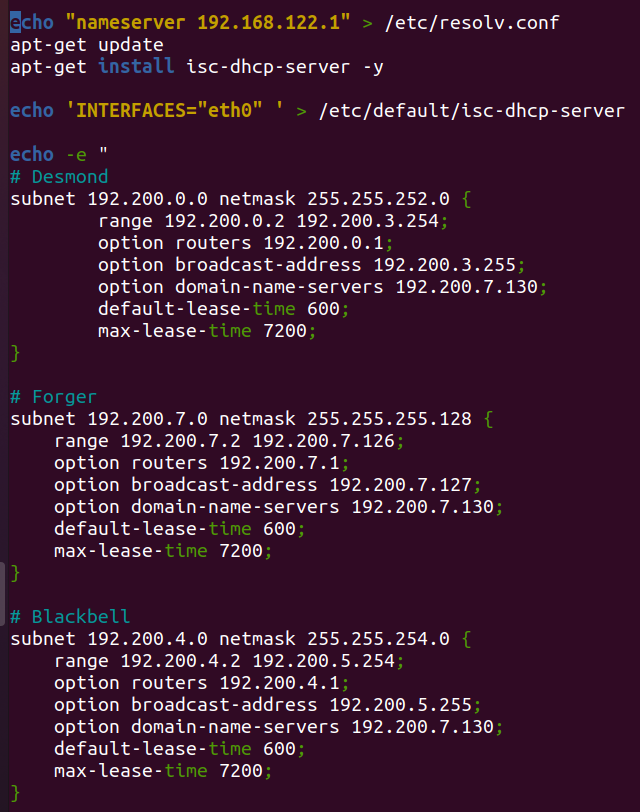

# Jarkom Modul 5 F02 2022

### Anggota:

1. [Andymas Narendra Bagaskara](https://github.com/zaibir123) (05111940000192)
2. [Jayanti Totti Andhina](https://github.com/JayantiTA) (5025201037)
3. [Gaudhiwaa Hendrasto](https://github.com/gaudhiwaa) (5025201066)

### (A) Membuat topologi jaringan sesuai dengan rancangan yang diberikan Loid:

Keterangan : Eden adalah DNS Server

WISE adalah DHCP Server

Garden dan SSS adalah Web Server

Jumlah Host pada Forger adalah 62 host

Jumlah Host pada Desmond adalah 700 host

Jumlah Host pada Blackbell adalah 255 host

Jumlah Host pada Briar adalah 200 host

### (B) Membuat topologi tersebut menggunakan teknik VLSM setelah melakukan subnetting.

| Subnet | Jumlah IP | Netmask |
|--------|-----------|---------|
| A1     | 3         | /29     |
| A2     | 63        | /25     |
| A3     | 701       | /22     |
| A4     | 2         | /30     |
| A5     | 2         | /30     |
| A6     | 256       | /23     |
| A7     | 201       | /24     |
| A8     | 3         | /29     |
| Total  | 1231      | /21     |

Tree:

### (C) Melakukan Routing agar setiap perangkat pada jaringan tersebut dapat terhubung.

**Konfigurasi Network Interfaces**

Strix:

Westalis:

Ostania:

Forger, Desmond, Blackbell, Briar:

Eden:

Wise:

Garden:

SSS:

**Routing**

Strix:

Westalis:

Ostania:

### (D) Memberikan ip pada subnet Forger, Desmond, Blackbell, dan Briar secara dinamis menggunakan bantuan DHCP server. Kemudian kalian ingat bahwa kalian harus setting DHCP Relay pada router yang menghubungkannya.

**Eden** sebagai DNS Server:

**Wise** sebagai DHCP Server:

**Ostania** dan **Westalis** sebagai DHCP Relay:

**Garden** dan **SSS** sebagai Web Server:

#### 1.  Agar topologi yang kalian buat dapat mengakses keluar, kalian diminta untuk mengkonfigurasi Strix menggunakan iptables, tetapi Loid tidak ingin menggunakan MASQUERADE.

Script pada **Strix:**

#### 2.  Kalian diminta untuk melakukan drop semua TCP dan UDP dari luar Topologi kalian pada server yang merupakan DHCP Server demi menjaga keamanan.

Script pada **Strix:**

**Testing:**

Client:

#### 3.  Loid meminta kalian untuk membatasi DHCP dan DNS Server hanya boleh menerima maksimal 2 koneksi ICMP secara bersamaan menggunakan iptables, selebihnya didrop.

Script pada **Eden** dan **Wise:**

**Testing:**

Menuju Eden:

Client1:

Client2:

Client3:

Menuju Wise:

Client1:

Client2:

Client3:

#### 4.  Akses menuju Web Server hanya diperbolehkan disaat jam kerja yaitu Senin sampai Jumat pada pukul 07.00 - 16.00.

Script pada **Garden**:

Script pada **SSS**:

**Testing:**

Sesuai jam kerja:

Menuju Garden:

Menuju SSS:

Di luar jam kerja:

Menuju Garden:

Menuju SSS:

#### 5.  Karena kita memiliki 2 Web Server, Loid ingin Ostania diatur sehingga setiap request dari client yang mengakses Garden dengan port 80 akan didistribusikan secara bergantian pada SSS dan Garden secara berurutan dan request dari client yang mengakses SSS dengan port 443 akan didistribusikan secara bergantian pada Garden dan SSS secara berurutan.

**Testing:**

Blackbell menuju Graden dengan port 80

Briar menuju Garden dengan port 80

Blackbell menuju SSS dengan port 443

Briar menuju SSS dengan port 443

#### 6.  Karena Loid ingin tau paket apa saja yang di-drop, maka di setiap node server dan router ditambahkan logging paket yang di-drop dengan standard syslog level.

Script pada **Strix**:

